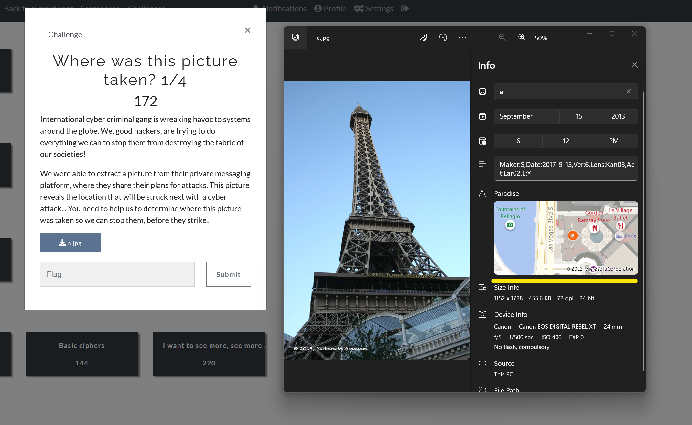
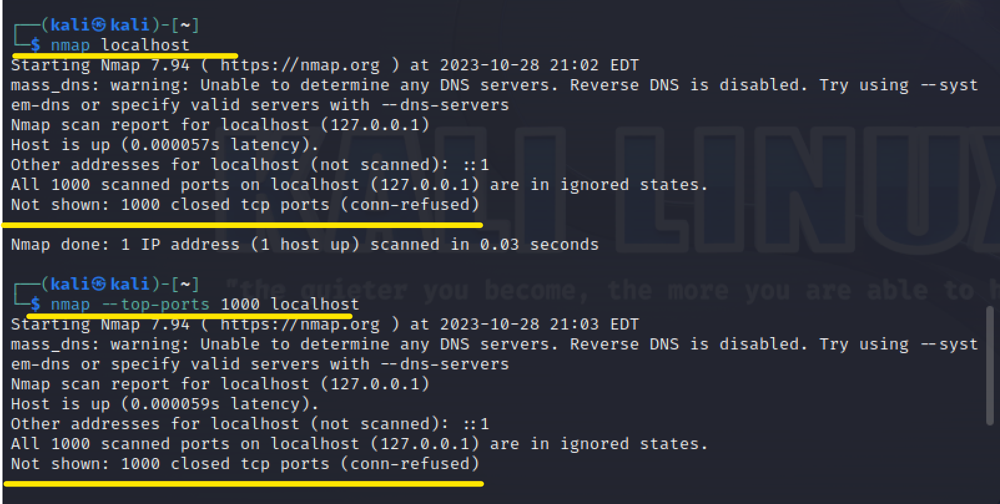
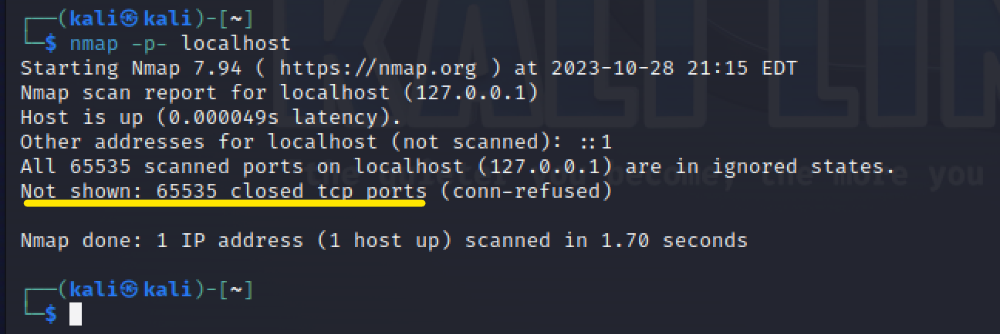
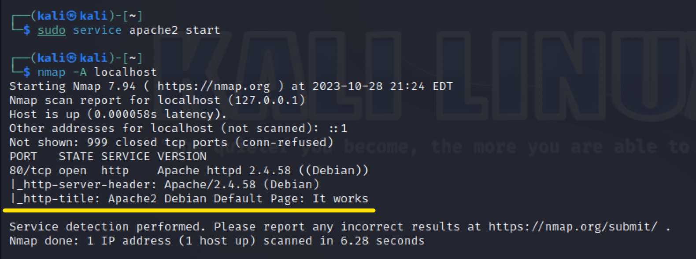
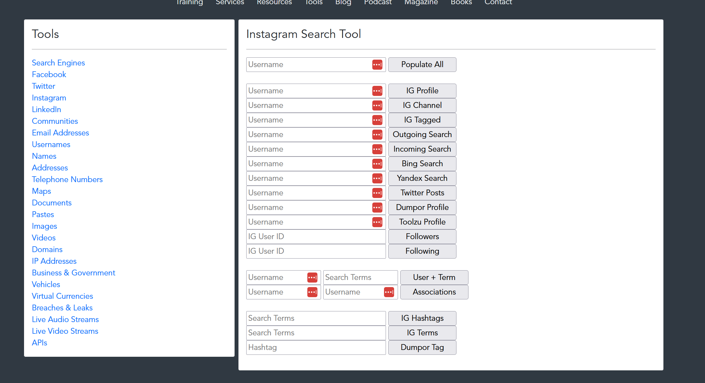

# H1

x) Lue/katso ja tiivistä. (Tässä x-alakohdassa ei tarvitse tehdä testejä tietokoneella, vain lukeminen tai kuunteleminen ja tiivistelmä riittää. Tiivistämiseen riittää muutama ranskalainen viiva.)

a) Ratkaise Over The Wire: Bandit kolme ensimmäistä tasoa (0-2).

Enismmäinen tehtävä vaatii, että osaa käyttää SSH:ta. Tehtävässä annetaan valmiiksi jo käyttäjä ja salasna, ne pitää vain ostata laittaa oikein komentoon.

Seuraavassa tehtävässä pitää hakea lukea readme tiedosto $cat readme komennolla. Salasanan kopioiminen onnistuu kätevästi klikkaamalla hiiren oikealla salasanaa kun kirjautuu seuraavalle tasolle. (Ainakin powershellillä)

Kolmannessa tethävässä pitää suorittaa cat komento, mutta täydellä tiedosto polulla.

b) Ratkaise Challenge.fi:stä yksi tehtävä, esim. Challenge.fi 2021 Where was this picture taken, Encoding basics.

Tässä tehtävässä pitää mennä tarkastelemaan kuvan metadataa ja sieltä selviää missä kuva on otettu.

c) Ratkaise PortSwigger Labs: Lab: SQL injection vulnerability in WHERE clause allowing retrieval of hidden data. 

Tässä tehtävässä pitää muokata selaimen hakukenttää niin, että "leikkaat" keskelle SQL komentoa käyttämällä heittomerkkiä Gifts kategorian jälkeen ja syöttämällä oman komennon tämän perään. Loput oikeasta komennosta "poistetaan" muuttaamalla ne kommentiksi kahdella väliviivalla.

d) Asenna Linux virtuaalikoneeseen. Suosittelen joko Kali (viimeisin versio) tai Debian 12-Bookworm.

Haetaan valmis virtualbox image täältä: https://www.kali.org/get-kali/#kali-virtual-machines. 

Kun tiedosto on ladannut se pitää purkaa haluamaasi kansioon jonka jälkeen "add" painikkeella saa haettua kyseisen kali imagen ja käynnistettyä sen. 

e) Porttiskannaa 1000 tavallisinta tcp-porttia omasta koneestasi (localhost). Analysoi tulokset.

Skannasin 1000 tavallisinta porttia kahdella eri menetelmällä `nmap --top-ports 1000 localhost` ja `nmap localhost`. Kummastakin vähemmän yllättävästi sama tulos. Skannaus ei löytäny DNS palvelimia ja totesi, että kaikki 1000 porttia on suljettuna.  Olettaisin, että jokin on pielessä...

f) Porttiskannaa kaikki koneesi (localhost) tcp-portit. Analysoi tulokset. 

Laajempi scannaus `nmap -p- localhost` komennolla. Yhä vain suljettuja portteja.

g) Tee laaja porttiskanaus (nmap -A) omalle koneellesi (localhost), kaikki portit.

Tilanne on yhä sama katsomani perusteella.

h) Asenna ja käynnistä jokin palvelin (apache, ssh...) koneellesi. Vertaile, miten porttiskannauksen tulos eroaa.

Asensin apachen komennoilla `$ sudo apt-get install apache2` ja käynnistin `$ sudo service apache2 start`. Kun apache oli käynnisestty niin skannauskin tuotti uuden tuloksen! Portti 80 on auki ja sitä käyttää apache. Scannaus myös kertoo apachen version ja sen että default sivu toimii.

i) Kokeile ja esittele jokin avointen lähteiden tiedusteluun sopiva weppisivu tai työkalu. Hyviä esimerkkejä löytyy Bazzel: IntelTechniques: Tools ja Bellingcat: Resources, voit myös käyttää muuta itse valitsemaasi työkalua. Työkalua pitää siis myös kokeilla, pelkkä nimen mainitseminen ei riitä. Pidä esimerkit harmittomina, älä julkaise kenenkään henkilökohtaisia salaisuuksia raportissasi.

Kokeilin tätä: Bazzel: IntelTechniques: Tools. Sivulta löytyi uiseita erilaisia hakukoneita, mihin pystyi tehokkaasti kopioimaan haluamansa tiedon jota voi hakea sitten nopeasti eri hakukoneista yms. Kuvassa esimerkiksi useampi hakukone instagram tilien hakemiseen.

## Lähteet
Karvinen 2023: Ethical Hacking 2023 https://terokarvinen.com/2023/eettinen-hakkerointi-2023/

PortSwigger: SQL injection https://portswigger.net/web-security/sql-injection

GenZ Hack Challenge 2021: https://2021.challenge.fi/challenges

man nmap
