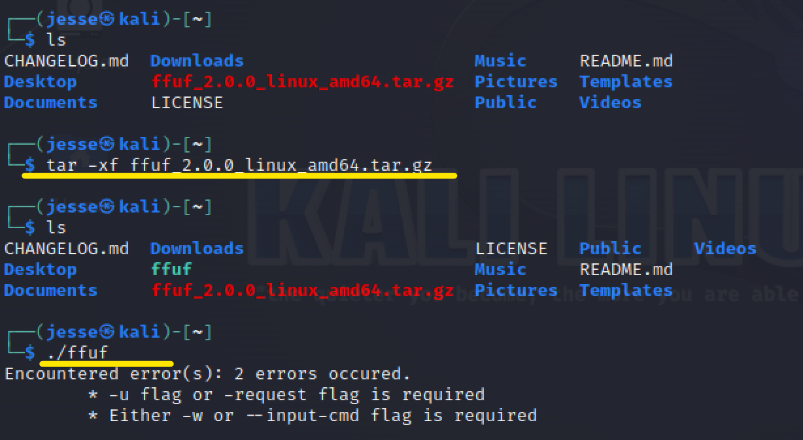
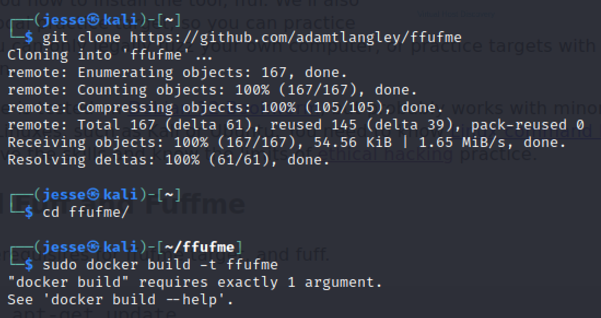
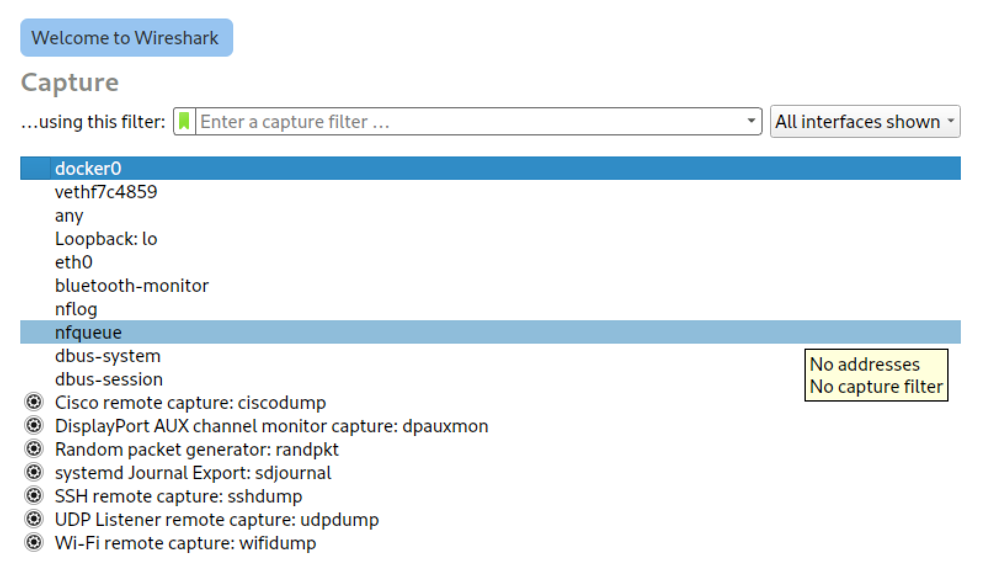
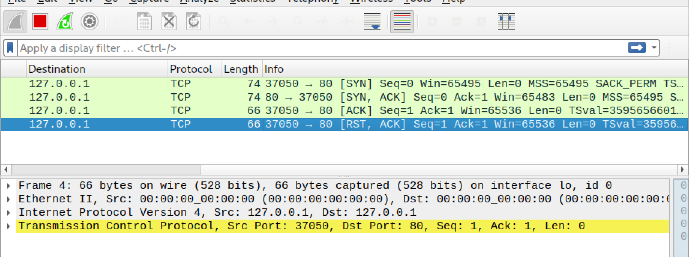
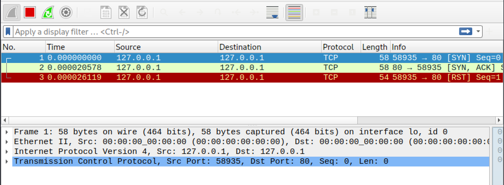
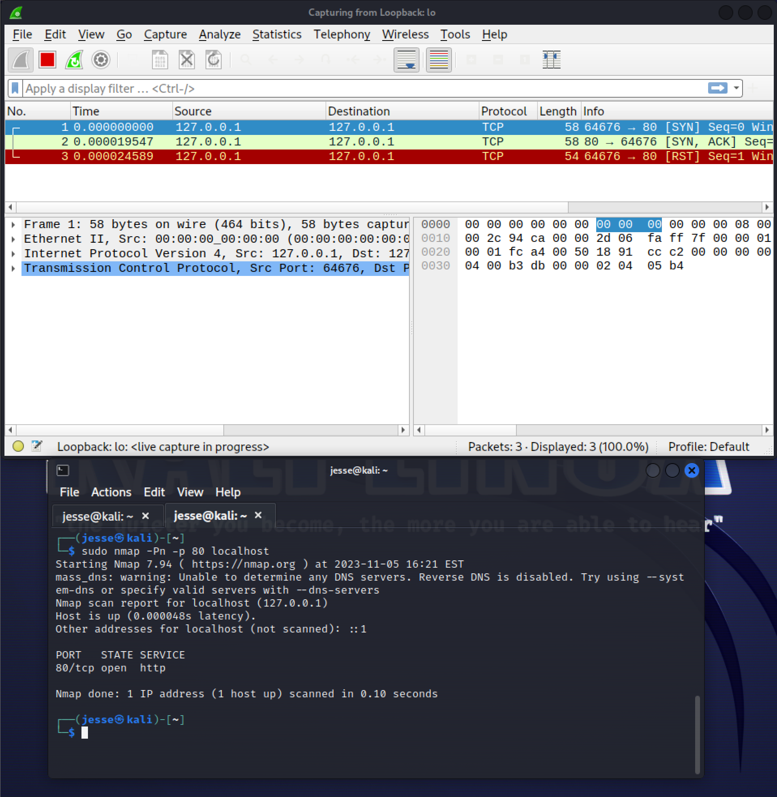
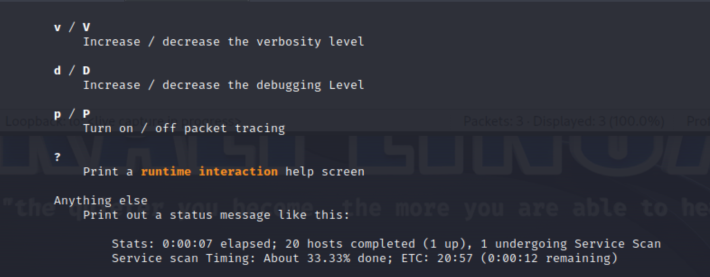
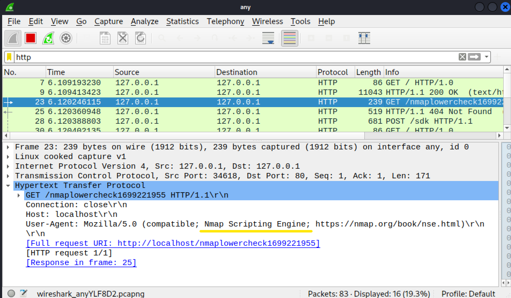

#H2

## a) Fuff. Ratkaise Teron ffuf-haastebinääri.

Aloitan tämän harjoituksen alkusi hieman tutustumalla tähän teron artikkeliin: https://terokarvinen.com/2023/fuzz-urls-find-hidden-directories/. Aion myös käyttää sitä tukena tässä harjoituksessa. Aloitan lataamalla haastebinäärin dirfuzt-1:n sivun lopusta. Seuraavaksi haen sen linuxin hakemistosta downloads kansiosta ja annetaan oikeudet ajaa tämä tiedosto. Kun ajan tiedoston se ohjeistaa minut avaamaan URL:n selaimessa.

Ajo oikeudet `chmod u+x dirfuzt-1`
Tiedoston ajo `./dirfuzt-1`


Sitten asennetaan ffuf käyttämällä teron ohjeita.

Lataaminen `wget https://github.com/ffuf/ffuf/releases/download/v2.0.0/ffuf_2.0.0_linux_amd64.tar.gz`
Purku `tar -xf ffuf_2.0.0_linux_amd64.tar.gz`



Ladataan vielä Seclists kirjasto jonka jälkeen sammutellaan nettiyhteys ettei sekoilla fuzzerin kanssa vahingossa.


Kun netti on suljettu ajetaan fuzzeri juuri hankitulla kirjastolla ja kohteeksi valitaan hasteen antama IP osoite. 

`./ffuf -w common.txt -u http://127.0.0.2:8000/FUZZ`


Nyt tuli paljon tavaraa. Tätä ilmeisesti pitää jotenkin suodattaa, ettei olisi näin paljon tutkailtavaa. Kun selaa hieman läpi tuloksia niin ilmenee, että yleinen tiedoston koko on 154 tavua. Suodatetaan ne pois komennolla: 

`./ffuf -w common.txt -u http://127.0.0.2:8000/FUZZ -fs 154`

Saatiin aika huomattavasti lyhyempi lista.


Tuosta kun käy läpi ihan manuaalisesti niin löytyy muutama osuma jotka voisivat vastata tehtävän vaatimia sivuja. 

`.git/logs/`
`wp-admin`

Nuo kun iskee selaimen urliin, niin huomataan että ollaan löydetty oikeille sivuille.


## b) Fuffme. Asenna Ffufme harjoitusmaali paikallisesti omalle koneellesi. Ratkaise tehtävät (kaikki paitsi ei "Content Discovery - Pipes")

Asennetaan ensin teron ohjeen mukaisesti tarvittavia ohjelmia.


Luodaan ffufme maali ja ajetaan se.




Ladataan vielä tehtävään tarvittavat sanalistat. 
```
$ mkdir $HOME/wordlists
$ cd $HOME/wordlists
$ wget http://ffuf.me/wordlist/common.txt
$ wget http://ffuf.me/wordlist/parameters.txt 
$ wget http://ffuf.me/wordlist/subdomains.txt
```

Aloitetaan harjoitusten tekeminen uudella maalilla. 

`ffuf -w wordlists/common.txt -u http://localhost/cd/basic/FUZZ`


Seuraavaksi harjoituksessa käytetään komentoa joka toistaa scannauksen aina kun se löytää uuden kansion. Tässä tapauksessa admin kansiosta löytyi users kansio jonka sisällä käyttäjä 96.

`ffuf -w wordlists/common.txt -recursion -u http://localhost/cd/recursion/FUZZ`


Seuraavaksi käytetään komentoa millä voidaan määritellä tiedosto muoto.

`ffuf -w wordlists/common.txt -e .log -u http://localhost/cd/ext/logs/FUZZ`


Seuraavassa tehtävässä pitää taas suodattaa ylimääräisiä osumia pois. Tässä on monissa osumissa havaittavissa sama tiedosto koko 669 tavua. 

`ffuf -w wordlists/common.txt -u http://localhost/cd/no404/FUZZ -fs 669 `


Nyt haetaam data kansiolle oikea parametri käyttämällä parametri kirjastoa.

`ffuf -w wordlists/parameters.txt -u http://localhost/cd/param/data?FUZZ=1`


Seuraavassa tehtävässä pitää hidastaa scannausta jotta selain ei anna virheitä. Scannaus on huomattavasti hitaampi ja lopulta se kesti 1 min ja 35 sec. Ymmärtääkseni tällä komennolla olisi pitänyt löytyä oracle tiedosto, mutta eipä löytynyt...


Viimeiseksi scannataan subdomaineja. Tässä taas suodattaminen on olennaista koska jos esimerkin ensimmäistä komentoa käyttää tulee 1907 tulosta. Jos suodatetaan 1495 tavuiset domainit pois, jää jäljelle vain redhat.


`ffuf -w wordlists/subdomains.txt -H "Host: FUZZ.ffuf.me" -u http://localhost -fs 1495`

## Porttiskannaa paikallinen kone (127.0.0.2 tms), sieppaa liikenne snifferillä, analysoi.

## c) nmap TCP connect scan -sT

Aloin lisäämällä käyttäjäni ryhään wireshark teron ohejiden mukaisesti. 

```
$ sudo adduser $(whoami) wireshark # log out, log back
[sudo] password for jesse: 
info: Adding user `jesse' to group `wireshark' ...
```

Törmäsin aluksi tälläiseen ongelmaan, että wireshark ei suostunut näyttämään mitään tarpeellisia liitäntöjä. Tämä selvisi hetken ihmettelyn jälkeen, että wireshark täytyy ajaa sudoma, jotta saa oikeudet niihin liitäntöihin.


Tässä vielä miltä se oikeasti pitäisi näyttää.



Laitoin wiresharkin skannamaan liitäntää loopback: io ja ajoin nmapilla scannin:

```
sudo nmap -sT localhost  
```

Tällä komennolla tuli aivan liikaa tavaraa, joten rajoitin sen vielä porttiin 80 jonka tiedän olevan auki aiemmasta tehtävästä.

```
sudo nmap -sT -p 80 localhost  
```
Tällä saatiin järkevä määrä tavaraa. Tuosta näkyy, että olaan tehty TCP kättely jonka jälkeen clientti on katkaissut yhteyden.



## d) nmap TCP SYN "used to be stealth" scan, -sS (tätä käytetään skannatessa useimmin)

Tämä vaikutti hyvin samalta kuin edellinen, mutta hieman lyhyempi. Yhteys katkaistiin heti ensimmäisen vastauksen jälkeen.

```
sudo nmap -sS -p 80 localhost 
```



## e) nmap ping sweep -sn

Annoin tämän komennon:
```
sudo nmap -sn localhost  
```
ja sain tulosteeksi seuraavaa. Wiresharkissa ei näkynyt mitään.
```
Starting Nmap 7.94 ( https://nmap.org ) at 2023-11-05 15:56 EST
mass_dns: warning: Unable to determine any DNS servers. Reverse DNS is disabled. Try using --system-dns or specify valid servers with --dns-servers
Nmap scan report for localhost (127.0.0.1)
Host is up.
Other addresses for localhost (not scanned): ::1
Nmap done: 1 IP address (1 host up) scanned in 0.00 seconds
```
Tämän tarkoitus kuitenkin on löytää päällä olevia palvelimia, mutta outoa kai mielestäni, että se ei näy mitenkään wiresharkissa vaikka nmap tunnistaakin localhostin olevan käynnissä.

## f) nmap don't ping -Pn

Tämän lopputulos näyttää lähes samalta kuin stealth scannin.



## g) nmap version detection -sV (esimerkki yhdestä palvelusta yhdessä portissa riittää)

Tässä huomataan, että kun scannataan porttia 80 sieltä löytyy nginx weppi palvelin. Hain myös wiresharkista aika randomilla HTTP paketin ja kun sitä tarkkaili, niin sieltäkin selviää mistä ohjelmasta/versiosta on kyse. 

```
$ sudo nmap -sV -p 80 localhost                                                                
Starting Nmap 7.94 ( https://nmap.org ) at 2023-11-05 16:25 EST
mass_dns: warning: Unable to determine any DNS servers. Reverse DNS is disabled. Try using --system-dns or specify valid servers with --dns-servers
Nmap scan report for localhost (127.0.0.1)
Host is up (0.000052s latency).
Other addresses for localhost (not scanned): ::1

PORT   STATE SERVICE VERSION
80/tcp open  http    nginx 1.18.0 (Ubuntu)
Service Info: OS: Linux; CPE: cpe:/o:linux:linux_kernel

Service detection performed. Please report any incorrect results at https://nmap.org/submit/ .
Nmap done: 1 IP address (1 host up) scanned in 6.21 seconds

```


## h) nmap output files -oA foo. Miltä tiedostot näyttävät? Mihin kukin tiedostotyyppi sopii?


Ajoin kyseisen komennon nmapille:
```
$ sudo nmap -oA foo -p 80 localhost                                                            
```

Tulosteeksi sain kolme eri tiedostoa. Ne vaikuttavat olevan vain eri taoisia yksityiskohtaisuuden puolesta.

```
$ cat foo.gnmap                                                                                
# Nmap 7.94 scan initiated Sun Nov  5 16:35:04 2023 as: nmap -oA foo -p 80 localhost
Host: 127.0.0.1 (localhost)     Status: Up
Host: 127.0.0.1 (localhost)     Ports: 80/open/tcp//http///
# Nmap done at Sun Nov  5 16:35:04 2023 -- 1 IP address (1 host up) scanned in 0.07 seconds

```
```
$ cat foo.nmap                                                                                 
# Nmap 7.94 scan initiated Sun Nov  5 16:35:04 2023 as: nmap -oA foo -p 80 localhost
mass_dns: warning: Unable to determine any DNS servers. Reverse DNS is disabled. Try using --system-dns or specify valid servers with --dns-servers
Nmap scan report for localhost (127.0.0.1)
Host is up (0.000052s latency).
Other addresses for localhost (not scanned): ::1

PORT   STATE SERVICE
80/tcp open  http

# Nmap done at Sun Nov  5 16:35:04 2023 -- 1 IP address (1 host up) scanned in 0.07 seconds

```
```
$ cat foo.xml 
<?xml version="1.0" encoding="UTF-8"?>
<!DOCTYPE nmaprun>
<?xml-stylesheet href="file:///usr/bin/../share/nmap/nmap.xsl" type="text/xsl"?>
<!-- Nmap 7.94 scan initiated Sun Nov  5 16:35:04 2023 as: nmap -oA foo -p 80 localhost -->
<nmaprun scanner="nmap" args="nmap -oA foo -p 80 localhost" start="1699220104" startstr="Sun Nov  5 16:35:04 2023" version="7.94" xmloutputversion="1.05">
<scaninfo type="syn" protocol="tcp" numservices="1" services="80"/>
<verbose level="0"/>
<debugging level="0"/>
<host starttime="1699220104" endtime="1699220104"><status state="up" reason="localhost-response" reason_ttl="0"/>
<address addr="127.0.0.1" addrtype="ipv4"/>
<hostnames>
<hostname name="localhost" type="user"/>
<hostname name="localhost" type="PTR"/>
</hostnames>
<ports><port protocol="tcp" portid="80"><state state="open" reason="syn-ack" reason_ttl="64"/><service name="http" method="table" conf="3"/></port>
</ports>
<times srtt="52" rttvar="5000" to="100000"/>
</host>
<runstats><finished time="1699220104" timestr="Sun Nov  5 16:35:04 2023" summary="Nmap done at Sun Nov  5 16:35:04 2023; 1 IP address (1 host up) scanned in 0.07 seconds" elapsed="0.07" exit="success"/><hosts up="1" down="0" total="1"/>
</runstats>
</nmaprun>
```

## i) nmap ajonaikaiset toiminnot (man nmap: runtime interaction): verbosity v/V, help ?, packet tracing p/P, status s (ja moni muu nappi)

Nämä toiminnot antavat mahdollisuuden ajon aikana pyytää lisää tietoa prosessin etenemisestä. Verbosen lisääminen alkaa syöttämään enemmän tieto prosessista. Tämä on esimerkiksi kätevää jos terminaalissa on jokin prosessi kesken eikä se ilmoita mitään. Voi olla että jotain on vielä kesken, mutta se ei kerros sitä. Verbosen lisääminen tuottaa prosessista tietoa jolla voit selvittää tapahtuuko prosessissa todella mitään.



## j) Ninjojen tapaan. Piiloutuuko nmap-skannaus hyvin palvelimelta? Vinkkejä: Asenna Apache. Aja nmap-versioskannaus -sV tai -A omaan paikalliseen weppipalvelimeen. Etsi Apachen lokista tätä koskevat rivit. Wiresharkissa "http" on kätevä filtteri, se tulee siihen yläreunan "Apply a display filter..." -kenttään. Nmap-ajon aikana p laittaa packet tracing päälle. Vapaaehtoinen lisäkohta: jääkö Apachen lokiin jokin todiste nmap-versioskannauksesta?

Asennellaan apassi ja käynnistellään.

```
sudo apt-get install apache2
sudo systemctl restart apache2.service
```
Ajetaan sitten nmap komento

```
sudo nmap -sV -p 80 localhost
```

Wiresharkkia kun vähän kaivelee niin nopeasti löytää rivin missä on jotain mainintaa nmapista. Eipä ollutkaan niin ninjaisaa.



## k) UDP-skannaus. UDP-skannaa paikkalinen kone (-sU). "Mulla olis vitsi UDP:sta, mutta en tiedä menisikö se perille":

Skannasin paikallisen koneen, mutta sieltä ei löytynyt yhtään avointa UDP porttia.

```
sudo nmap -sU localhost
Starting Nmap 7.94 ( https://nmap.org ) at 2023-11-05 17:11 EST
mass_dns: warning: Unable to determine any DNS servers. Reverse DNS is disabled. Try using --system-dns or specify valid servers with --dns-servers
Nmap scan report for localhost (127.0.0.1)
Host is up (0.0000040s latency).
Other addresses for localhost (not scanned): ::1
All 1000 scanned ports on localhost (127.0.0.1) are in ignored states.
Not shown: 1000 closed udp ports (port-unreach)

Nmap done: 1 IP address (1 host up) scanned in 0.14 seconds

```

## l) Miksi UDP-skannaus on hankalaa ja epäluotettavaa? Miksi UDP-skannauksen kanssa kannattaa käyttää --reason flagia ja snifferiä? (tässä alakohdassa vain vastaus viitteineen, ei tarvita testiä tietokoneella)

Katsoin [täältä](https://networkengineering.stackexchange.com/questions/71000/why-is-a-udp-port-scan-more-complex-than-tcp-port-scan) vähän vihiä aiheeseen. UDP porttien skannaus on hankalaa koska niillä ei ole yhtä tiettyä kättelyä mihin ne vastaavat. Pitäisi osata arvata mikä sovellus kuuntelee sitä porttia ja käyttä sen protokollaa. Ne ei siis välttämättä vastaa mitään vaikka olisivatkin auki. 

