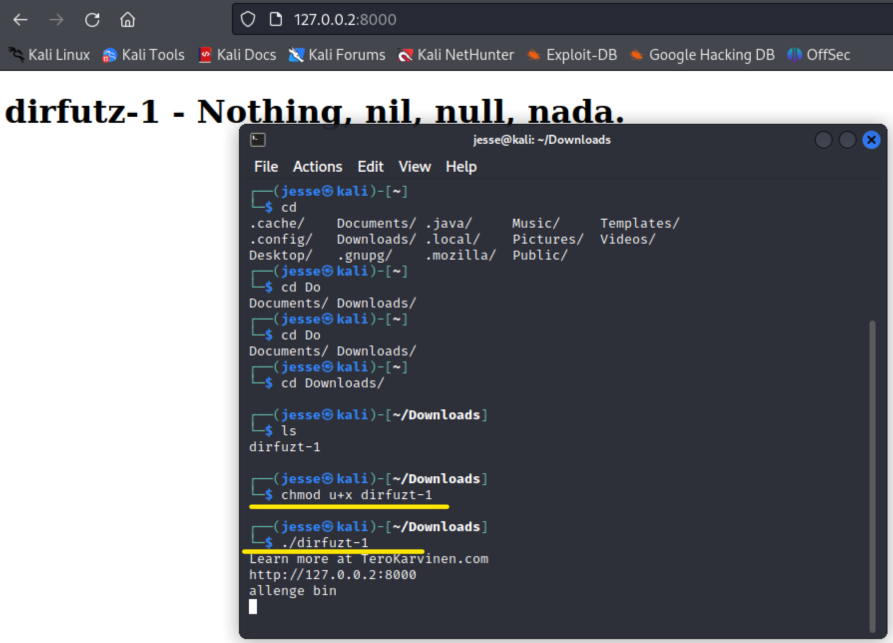
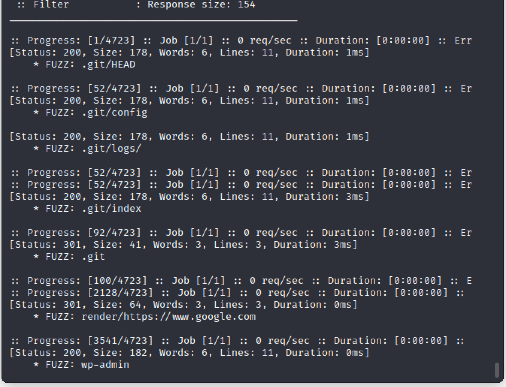
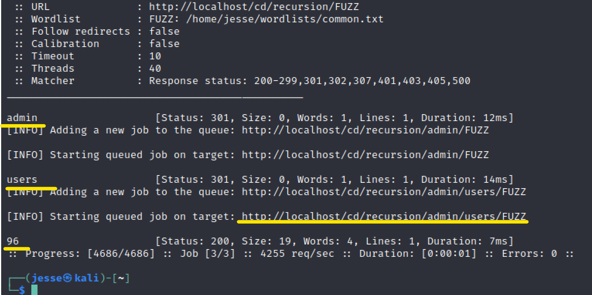
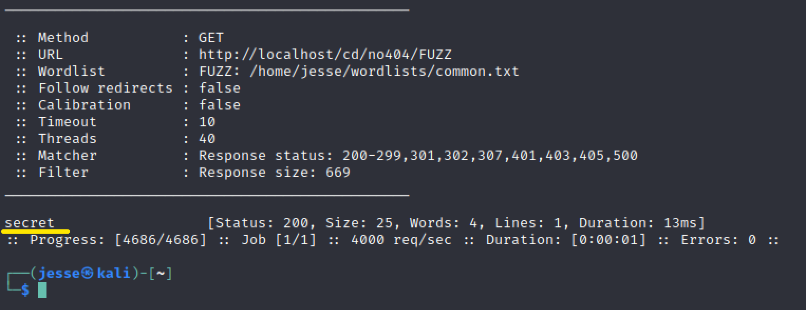
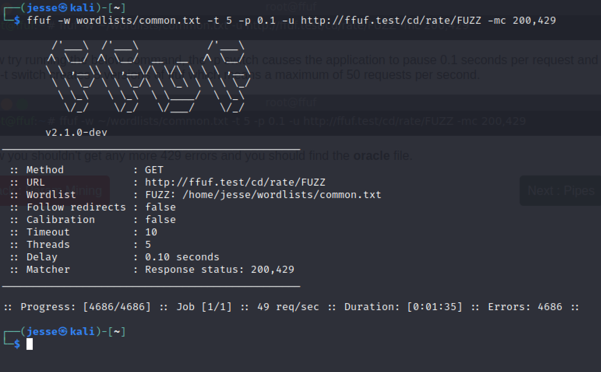
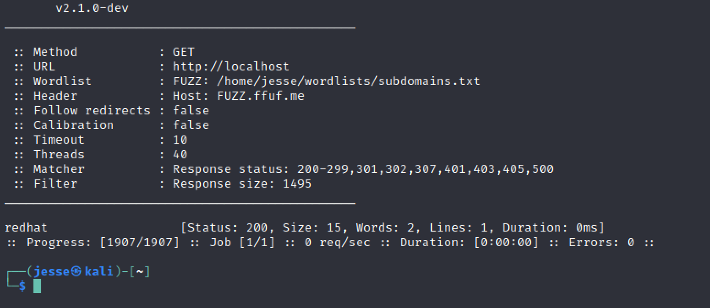

#H2

a) Fuff. Ratkaise Teron ffuf-haastebinääri.

Aloitan tämän harjoituksen alkusi hieman tutustumalla tähän teron artikkeliin: https://terokarvinen.com/2023/fuzz-urls-find-hidden-directories/. Aion myös käyttää sitä tukena tässä harjoituksessa. Aloitan lataamalla haastebinäärin dirfuzt-1:n sivun lopusta. Seuraavaksi haen sen linuxin hakemistosta downloads kansiosta ja annetaan oikeudet ajaa tämä tiedosto. Kun ajan tiedoston se ohjeistaa minut avaamaan URL:n selaimessa.

Ajo oikeudet `chmod u+x dirfuzt-1`
Tiedoston ajo `./dirfuzt-1`



Sitten asennetaan ffuf käyttämällä teron ohjeita.

Lataaminen `wget https://github.com/ffuf/ffuf/releases/download/v2.0.0/ffuf_2.0.0_linux_amd64.tar.gz`
Purku `tar -xf ffuf_2.0.0_linux_amd64.tar.gz`


Ladataan vielä Seclists kirjasto jonka jälkeen sammutellaan nettiyhteys ettei sekoilla fuzzerin kanssa vahingossa.


Kun netti on suljettu ajetaan fuzzeri juuri hankitulla kirjastolla ja kohteeksi valitaan hasteen antama IP osoite. 

`./ffuf -w common.txt -u http://127.0.0.2:8000/FUZZ`


Nyt tuli paljon tavaraa. Tätä ilmeisesti pitää jotenkin suodattaa, ettei olisi näin paljon tutkailtavaa. Kun selaa hieman läpi tuloksia niin ilmenee, että yleinen tiedoston koko on 154 tavua. Suodatetaan ne pois komennolla: 

`./ffuf -w common.txt -u http://127.0.0.2:8000/FUZZ -fs 154`

Saatiin aika huomattavasti lyhyempi lista.



Tuosta kun käy läpi ihan manuaalisesti niin löytyy muutama osuma jotka voisivat vastata tehtävän vaatimia sivuja. 

`.git/logs/`
`wp-admin`

Nuo kun iskee selaimen urliin, niin huomataan että ollaan löydetty oikeille sivuille.


b) Fuffme. Asenna Ffufme harjoitusmaali paikallisesti omalle koneellesi. Ratkaise tehtävät (kaikki paitsi ei "Content Discovery - Pipes")

Asennetaan ensin teron ohjeen mukaisesti tarvittavia ohjelmia.


Luodaan ffufme maali ja ajetaan se.


Ladataan vielä tehtävään tarvittavat sanalistat. 
```
$ mkdir $HOME/wordlists
$ cd $HOME/wordlists
$ wget http://ffuf.me/wordlist/common.txt
$ wget http://ffuf.me/wordlist/parameters.txt 
$ wget http://ffuf.me/wordlist/subdomains.txt
```

Aloitetaan harjoitusten tekeminen uudella maalilla. 

`ffuf -w wordlists/common.txt -u http://localhost/cd/basic/FUZZ`


Seuraavaksi harjoituksessa käytetään komentoa joka toistaa scannauksen aina kun se löytää uuden kansion. Tässä tapauksessa admin kansiosta löytyi users kansio jonka sisällä käyttäjä 96.

`ffuf -w wordlists/common.txt -recursion -u http://localhost/cd/recursion/FUZZ`



Seuraavaksi käytetään komentoa millä voidaan määritellä tiedosto muoto.

`ffuf -w wordlists/common.txt -e .log -u http://localhost/cd/ext/logs/FUZZ`


Seuraavassa tehtävässä pitää taas suodattaa ylimääräisiä osumia pois. Tässä on monissa osumissa havaittavissa sama tiedosto koko 669 tavua. 

`ffuf -w wordlists/common.txt -u http://localhost/cd/no404/FUZZ -fs 669 `



Nyt haetaam data kansiolle oikea parametri käyttämällä parametri kirjastoa.

`ffuf -w wordlists/parameters.txt -u http://localhost/cd/param/data?FUZZ=1`


Seuraavassa tehtävässä pitää hidastaa scannausta jotta selain ei anna virheitä. Scannaus on huomattavasti hitaampi ja lopulta se kesti 1 min ja 35 sec. Ymmärtääkseni tällä komennolla olisi pitänyt löytyä oracle tiedosto, mutta eipä löytynyt...



Viimeiseksi scannataan subdomaineja. Tässä taas suodattaminen on olennaista koska jos esimerkin ensimmäistä komentoa käyttää tulee 1907 tulosta. Jos suodatetaan 1495 tavuiset domainit pois, jää jäljelle vain redhat.



`ffuf -w wordlists/subdomains.txt -H "Host: FUZZ.ffuf.me" -u http://localhost -fs 1495`
